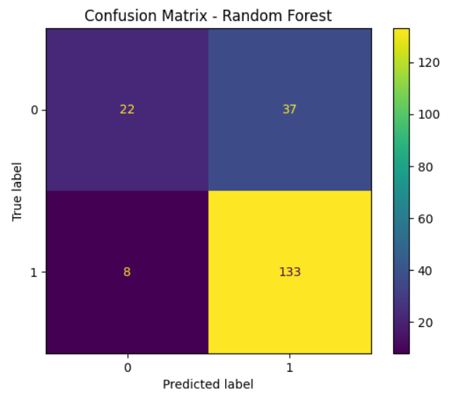
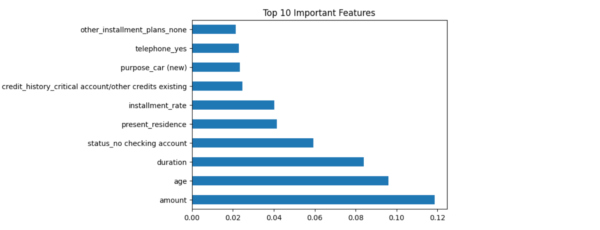

# 💳 Credit Scoring Model

## 📌 Objective
Predict whether an individual is creditworthy using financial data.

## 🧠 Algorithms Used
- Logistic Regression
- Decision Tree
- Random Forest

## 📊 Evaluation Metrics
- Accuracy
- Precision
- Recall
- F1 Score
- ROC-AUC

## 📈 Results
Random Forest performed best among all models.

## 📊 Sample Output
Accuracy: 0.85  
Precision: 0.82  
Recall: 0.80  
F1 Score: 0.81  
ROC-AUC: 0.88  

## 📷 Visualizations

### Confusion Matrix

### Feature Importance

## 🛠 Technologies Used
- Python
- Pandas
- NumPy
- Scikit-learn
- Matplotlib

## 🚀 Future Improvements
- Hyperparameter tuning
- Deployment using Streamlit
- Scikit-learn
- Matplotlib

## 💡 Real-World Use Case
This model can be used by banks and financial institutions to assess loan eligibility and reduce risk.
